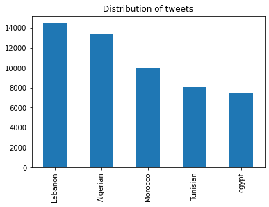
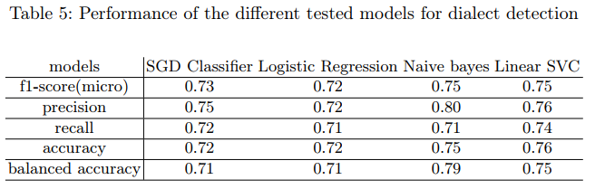

# finetuning-bert-models-for-arabic-dialect-detection
Finetuning of Arabert, Dziribert and Arabic Bert for dialect detection.

### Dataset
I used the [MSDA](https://msda.um6p.ma/home) Dialect Detection dataset which can be found on [this website](https://msda.um6p.ma/msda_datasets) along with other datasets, you can apply the same finetuning process on the other text classification datasets that you will find on the website, you just might need to take into consideration that they are umbalanced.

---

### Models
#### Pretraining Data

| Model | Dataset Size (Sentences/Size/nWords) |
| --- | --- | 
| Arabert (AraBERTv0.2-Twitter-base) | 200M / 77GB / 8.6B + 60M Multi-Dialect Tweets |
| Dziribert | 1.1M tweets / 150MB / 20M |
| Arabic Bert | - / 95GB / 8.2B |

#### Arabert
Paper: https://arxiv.org/abs/2003.00104   
Github Repo: https://github.com/aub-mind/arabert   
HuggingFace: https://huggingface.co/aubmindlab/bert-base-arabertv02-twitter   

#### Dziribert
Paper: https://arxiv.org/abs/2109.12346   
Github Repo: https://github.com/alger-ia/dziribert   
HuggingFace: https://huggingface.co/alger-ia/dziribert   

#### Arabic Bert
Github Repo: https://github.com/alisafaya/Arabic-BERT   
HuggingFace: https://huggingface.co/asafaya/bert-base-arabic   

---
### Results
The results of finetuning the mentionned models using the same hyperparameters. Dziribert being pretrained on so much less data and one dialect outperforms the other models.
| Model | Accuracy | F1 score | Precision | Recall |
| --- | --- | --- | --- | --- |
| Arabert | 0.82 | 0.82 | 0.82 | 0.82 |
| Dziribert | **0.84** | **0.84** | **0.84** | **0.84** |
| Arabic Bert | 0.81 | 0.81 | 0.81 | 0.81 |

To get a sense of where we are, here are the results of the baseline models from the MSDA paper: [An open access NLP dataset for Arabic dialects :
data collection, labeling, and model construction](https://arxiv.org/abs/2102.11000).

